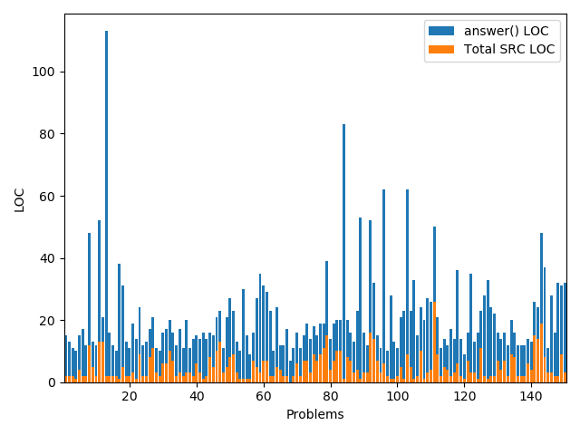
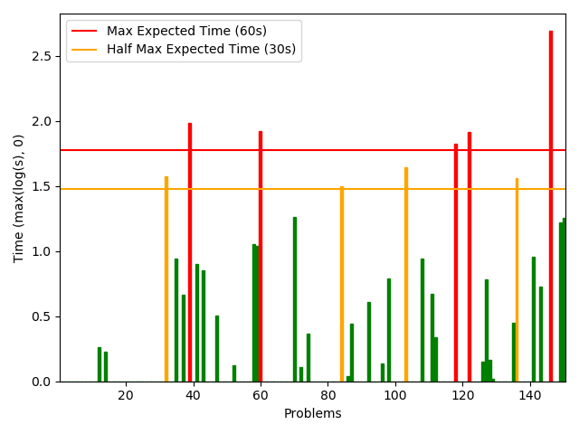
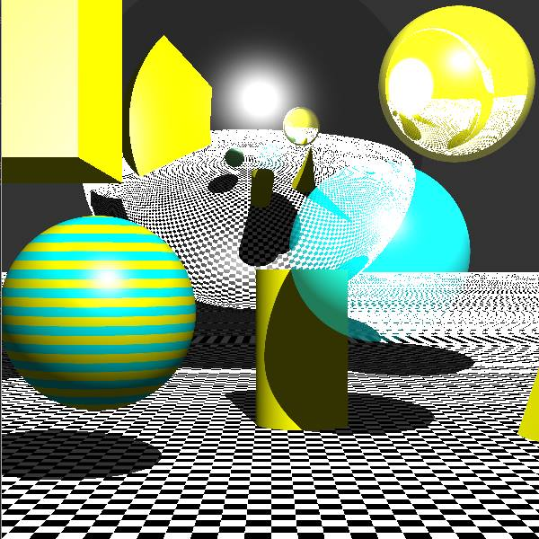

# SFI
The above image shows 
## Repositories
### Python Repositories
[Project Euler](https://github.com/zactodd/ProjectEuler) is a repoitory contain the the first 150 solution to the problems found on https://projecteuler.net/ using python 3.8. Below contains plots of lines of code (LOC), times for each of the answers.

  
  

[ElevatorSaga](https://github.com/zactodd/ElevatorSaga) is a respoitory for the testing of the level answers to the game ElevatorSage game for at https://play.elevatorsaga.com/ . The goal of the game is to write javascript code to control the eleivators.

[Rugbyscorigramy](https://github.com/zactodd/rugbyscorigramy) is respotory for webscarpping and visualising rugby data. Some of the visualisation are ... . ... can be seen below.

### Java Repositories
[CrimeSpy](https://github.com/zactodd/CrimeSpy) is a crime monitoring desktop application that can be used to view data from Chicago, Illion, USA. There is a tutorial for some of the various features located at the repository. As the code is from 2015, there may be unknown bugs.

[TuneOut](https://github.com/zactodd/TuneOut) is a music tutoring desk appliaction. It teachs a varity a musical stutures including notes, intervals, chords and more. A tutorial for on the reposiroy page. As the code is from 2016, there may be unknown bugs.

### C/C++ Repoistories

[Mircorcontroler Pong Game](https://github.com/zactodd/uc-fun-kit-pong) is a two player pong game that can be played between two UC fun kit mircorcontrollers. The two mircorcontrollers communicate using inferred red and conist of of a 7x5 LED display, and two button and 4-way joystick.

[Raytracing Example](https://github.com/zactodd/Ray-Tracing) is an example of various techiques involded in ray traching in the example seen below this includes; refections, shadows and transperany in a varity of 3D shpaes. AN example of this can be seen below.

  

